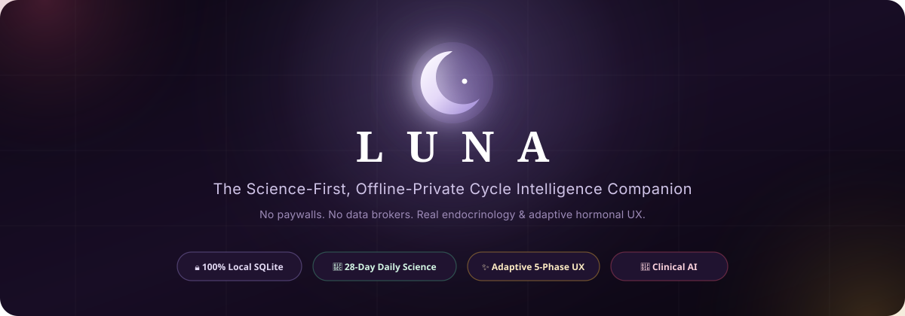
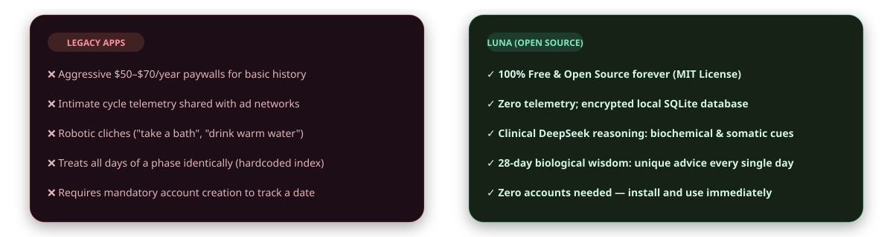
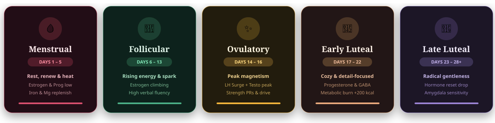

<p align="center">
  
</p>

<p align="center">
  <a href="https://flutter.dev"></a>
  <a href="https://riverpod.dev"></a>
  <a href="https://sqlite.org"></a>
  
  <a href="LICENSE"></a>
  <a href="CONTRIBUTING.md"></a>
</p>

<p align="center">
  <b>A science-first, offline-private cycle companion built for women who are tired of paywalled health data, intrusive ad trackers, and generic "drink more water" platitudes.</b>
</p>

---

## 🎯 Why Luna Exists

Most period-tracking apps treat a woman's body as an advertising asset or a static date counter. Luna was engineered from the ground up as a biological companion — honoring real endocrinology, 100% on-device privacy, and zero paywalls.

<p align="center">
  
</p>

---

## 🎨 The Adaptive Living Design System

Luna has no static dark or light mode. Instead, the entire visual language — ambient radial glows, typography highlights, card surfaces, and navigation accents — dynamically morphs to reflect your real hormonal state:

<p align="center">
  
</p>

<p align="center">
  
  
  
  
  
</p>

* **Menstrual (`#D94F6E`)**: Deep velvet crimson aesthetic. Focuses on uterine muscle relaxation, heat therapy, iron, and restorative stillness.
* **Follicular (`#4CAF87`)**: Vibrant emerald mint theme. Capitalizes on rising estrogen and dopamine for project kick-offs, social energy, and verbal fluency.
* **Ovulatory (`#F2B43A`)**: Citrine gold glow. Peak magnetism, strength PRs, and LH surge alignment.
* **Early Luteal (`#E8A87C`)**: Terracotta amber warmth. Progesterone-driven calm, detail orientation, and metabolic carb balance.
* **Late Luteal / PMS (`#9B84D4`)**: Twilight lavender ambiance. Gentle boundaries, amygdala sensitivity care, and biological PMS validation.

---

## ⚡ Core Feature Highlights

<table>
<tr>
<td width="50%" valign="top">

### 🧬 28-Day Biological Intelligence
* **Every Single Day Has Unique Science**: No repeated canned cards. Day 2 focuses on acute blood volume and iron loss; Day 8 targets prefrontal cortex synaptic density; Day 20 manages basal body temp elevation (~18°C sleep); Day 25 leverages natural COX-2 inhibitors for prostaglandin cramp prevention.
* **Mathematical Modulo Engine**: Continuous circular cycle projection ensures zero blank calendar states, whether reviewing past history or looking 6 months ahead.

</td>
<td width="50%" valign="top">

### 🧠 Longitudinal Pattern Engine
* **7-Log Calibration Baseline**: Luna avoids superficial or lazy guesses. It observes at least 7 multi-phase check-ins before confirming personal recurring rhythms (Late-Luteal Energy Troughs, Estrogen Dopamine Surges, Premenstrual Vulnerability, Prostaglandin Spikes).
* **Progressive Disclosure UI**: Daily signals stay clean and uncluttered at the top; deeper endocrine breakdowns expand cleanly on demand.

</td>
</tr>
<tr>
<td width="50%" valign="top">

### 📅 Visual Rhythm Calendar & Context-Aware Tracking
* **Continuous Period Flow Banding**: Menstrual bleeding days connect horizontally across the calendar grid with smooth, translucent ribbons.
* **Context-Aware Day 1 Anchoring**: Period started toggles adapt seamlessly to cycle status — no stuck, redundant buttons.
* **Adult Energy Slider**: Fast 1–5 interactive slider (*Drained* → *Peak*) to capture biological stamina.

</td>
<td width="50%" valign="top">

### 🤖 Clinical AI Companion & Discreet Telemetry
* **Zero Platitudes**: Strictly eliminates toxic positivity. Delivers actionable bio-chemical, somatic, and cognitive pacing vectors.
* **Discreet Token Telemetry**: Realtime background token usage reporting to Firebase RTDB with a secret 5-tap Admin Dashboard in Version Manager.
* **100% Offline Fallback**: Deterministic on-device fallback operates smoothly without connectivity.

</td>
</tr>
</table>

---

## 🔒 Privacy & Architecture Guarantees

* **100% On-Device SQLite**: All cycle entries, symptoms, notes, and profile settings remain exclusively in your phone's encrypted sandbox (`luna.db`).
* **Play Protect Certified**: Registered under official developer package ID `app.vakya.luna` for clean installs on Android certified devices.
* **Zero User Tracking**: No Google Analytics, no Facebook SDK, no AppsFlyer, no ad networks.
* **No Account Mandate**: Launch the app and use it immediately — no phone numbers, passwords, or emails required.

---

<details>
<summary><b>📂 Codebase Architecture &amp; File Tree (Click to expand)</b></summary>

```
lib/
├── core/
│   ├── constants/            # Phase color schemes, hormonal definitions & science knowledge
│   ├── models/               # UserProfile, LogEntry immutable data models
│   ├── providers/            # Riverpod state management (cycle, profile, dynamic theme)
│   ├── services/
│   │   ├── cycle_daily_intelligence.dart # 28-day individual day wisdom engine
│   │   ├── cycle_engine.dart             # Modulo arithmetic cycle calculator
│   │   ├── cycle_refinement_service.dart # Rolling average gap adjustment
│   │   ├── deepseek_service.dart         # Clinical AI client with strict JSON schema
│   │   ├── notification_service.dart     # Android 11+ local scheduled reminders & channels
│   │   ├── pattern_analysis_service.dart # 7-log longitudinal biomarker pattern recognition
│   │   ├── storage_service.dart          # Local SQLite & SharedPreferences persistence
│   │   └── telemetry_service.dart        # Asynchronous multi-device token telemetry
│   └── theme/                # LunaTheme dynamic 5-phase styling engine
├── features/
│   ├── calendar/             # Cycle rhythm calendar & day detail cards
│   ├── comfort/              # Comfort spin & dopamine care mode
│   ├── home/                 # Dynamic daily feed, playbook & body dispatch
│   ├── insights/             # Long-term blueprint, energy trends & mood climate
│   ├── knowledge/            # Women's health educational encyclopedia
│   ├── log/                  # Daily check-in logger (mood, adult energy slider, symptoms)
│   ├── luna_ai/              # Deep conversational companion
│   ├── nutrition/            # Craving-adaptive cycle nutrition sheet
│   ├── onboarding/           # 5-step smooth profile setup
│   ├── settings/             # Notification times, preferences & Version Manager
│   └── splash/               # Breathing radial orb splash
└── shared/
    └── widgets/              # Adaptive bottom navigation bar & custom phase orb
```

</details>

<details>
<summary><b>⚙️ Technical Stack &amp; Dependencies (Click to expand)</b></summary>

* **Framework**: Flutter (SDK `>=3.3.0 <4.0.0`, fully modernized for Flutter 3.27+)
* **Application ID**: `app.vakya.luna` (Play Protect Developer Console registered)
* **State Architecture**: [flutter_riverpod 2.6](https://pub.dev/packages/flutter_riverpod)
* **Persistence**: [sqflite 2.3](https://pub.dev/packages/sqflite) + [shared_preferences](https://pub.dev/packages/shared_preferences)
* **Routing**: [go_router 13.2](https://pub.dev/packages/go_router)
* **Typography**: Google Fonts (*Cormorant Garamond* for editorial luxury, *DM Sans* for UI clarity)
* **Motion & Polish**: [flutter_animate 4.5](https://pub.dev/packages/flutter_animate)

</details>

---

## 🚀 Quickstart & Development

### 1. Clone & Install
```bash
git clone https://github.com/rahul100ni/Luna.git
cd Luna
flutter pub get
```

### 2. Verify Code Quality
```bash
flutter analyze lib
flutter test
```
*Expected result: `No issues found!` and `All tests passed!`*

### 3. Run Locally
```bash
# Launch on connected Android device or emulator
flutter run
```

### 4. Build Release APK
```bash
flutter build apk --split-per-abi --release
```
The compiled production binaries will be generated at:
`build/app/outputs/flutter-apk/app-arm64-v8a-release.apk` (~9.5 MB)

### 📦 Download Pre-built Release APKs
Download the latest verified production builds from [GitHub Releases](https://github.com/rahul100ni/Luna/releases):
* **`Luna-v1.0.0.apk`** *(Recommended)*: Optimized for 64-bit ARM Android devices (~9.5 MB).
* **`Luna-universal.apk`**: Universal compatibility for all Android devices (~26 MB).
* **`Luna-armeabi-v7a.apk`**: For legacy 32-bit devices (~9.0 MB).
* **`Luna-x86_64.apk`**: For Android emulators and Chromebooks (~9.7 MB).

---

## 🤝 Contributing

Contributions are welcome from developers, designers, endocrinologists, and women's health advocates.
1. Fork the repository
2. Create a feature branch (`git checkout -b feature/amazing-feature`)
3. Ensure `flutter analyze lib` passes with **0 errors, 0 warnings**
4. Commit your changes (`git commit -m 'feat: add amazing feature'`)
5. Push to your branch (`git push origin feature/amazing-feature`)
6. Open a Pull Request

Please review our [Contributing Guide](CONTRIBUTING.md) for style and architecture guidelines.

---

## 📜 License

Distributed under the **MIT License**. See [LICENSE](LICENSE) for details.

<p align="center">
  <sub>Built with care for a healthier, scientifically intuitive understanding of the female body.</sub>
</p>
